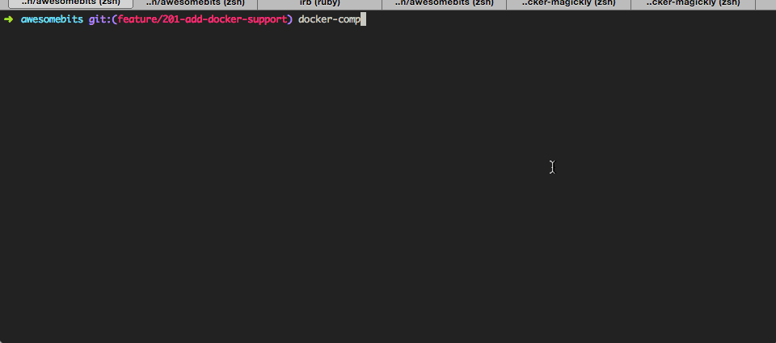
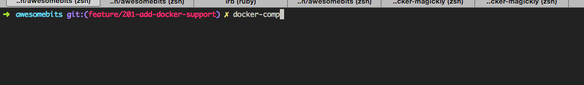

[](https://travis-ci.org/awesomefoundation/awesomebits)

AwesomeBits
===========

Configuration
-------------

### Docker

To start developing this project quickly, feel free to use the [docker-compose](https://docs.docker.com/compose/) workflow. This will install a local Postgres database in a Docker container, and the Rails app in another container.   

#### Installing the Docker runtime

##### Linux: Install the Native Docker Engine

If you're developing on a Linux system, follow [these instructions](https://docs.docker.com/installation/) to install Docker natively on your system. You will also need to install [Docker Compose](https://docs.docker.com/compose/install/).

##### Mac or Windows: Install Docker Machine

If you're developing from a Mac or Windows machine, you will need to use [Docker Machine](https://docs.docker.com/machine/) to run the Docker engine in a Linux VM and proxy commands to it. You can install Docker Machine via the [Docker Toolbox](https://www.docker.com/toolbox). The Docker toolbox will also install [Docker Compose](https://docs.docker.com/compose/).

Once you have Docker Machine installed, you'll need to create a new machine for this project. Assuming you have [Virtualbox](https://www.virtualbox.org/wiki/Downloads) installed, you'd run the following:

```bash
docker-machine create -d virtualbox awesomebits
eval $(docker-machine env awesomebits)
```

#### Starting the app with Docker Compose

Once you have the Docker engine and [Docker Compose](https://docs.docker.com/compose/install/) installed, you should be able to launch the app with the following command:

```bash
docker-compose up
```

If successful, your terminal should look something like this:



#### Executing arbitary commands with Docker Compose

You can also run arbitrary commands within the Docker container. For example, to run `rails console`, do the following:

```bash
docker-compose run web rails console
```



### Environment Variables

In order to set environment variables (for example, to enable S3 in your development environment),
create a file called `.env` in the main project directory. This file will look like this:

```shell
AWS_ACCESS_KEY_ID=XXX
AWS_SECRET_ACCESS_KEY=YYY
AWS_BUCKET=your-bucket-name
```

Countries
---------

Constant COUNTRY_PRIORITY used to define an array of priority countries. This
used in the Chapter Form to create quick access to popular countries; also used
in CountrySorter model for sorting the chapters.

Constant can be found in initializers file. /config/initializers/countries.rb


Localization
------------

Much of the AwesomeBits interface has been localized. Localization files are 
stored in two places, depending on the type of content being localized:

* Discrete srings and localizations are stored in config/locales/ directory
  with a separate file for each language
* Partials with localized content are stored in the app/views/locales/
  directory with the locale in the names of the file (i.e. _about_us.en.md)


Images
------

Images are resized dynamically via the [Magickly gem](http://magickly.afeld.me). 
In order to display images properly, you must have a Magickly installation running
and you must set the MAGICKLY_HOST environment variable to point to that host. 

e.g. If you are running Magickly localy on port 8888, add the following line to your `.env` file:

```shell
MAGICKLY_HOST=http://localhost:8888
```


Blacklist
---------

Very basic blacklisting is implemented using [Rack::Attack](https://github.com/kickstarter/rack-attack).
To blacklist an IP, simply add the IP address to the BLACKLIST_IPS environment
variable. Multiple IPs should be comma separated:

```shell
BLACKLIST_IPS=10.0.0.1,10.0.0.2
```


License
-------

AwesomeBits is Copyright 2012-2015, Institute on Higher Awesome Studies

This program is free software: you can redistribute it and/or modify
it under the terms of the GNU Affero General Public License as published by
the Free Software Foundation, either version 3 of the License, or
(at your option) any later version.

This program is distributed in the hope that it will be useful,
but WITHOUT ANY WARRANTY; without even the implied warranty of
MERCHANTABILITY or FITNESS FOR A PARTICULAR PURPOSE.  See the
GNU Affero General Public License for more details.

You should have received a copy of the GNU Affero General Public License
along with this program.  If not, see <http://www.gnu.org/licenses/>.
